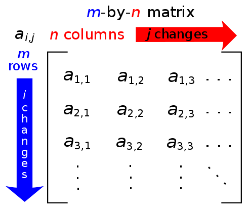

# Representing Data as Matrices


### Numpy and Matrices
The numpy package will provide you a great toolbox of optimized mathematical operations including the numpy array, the most convenient way to store vector and matrix data for computation. Here, we'll look at some basic operations in numpy.


```python
import numpy as np
```


```python
A = np.array([np.random.randint(0,10) for i in range(12)]).reshape((3,4)) #Create a 3x4 matrix with random integers 0-9
B = np.array([np.random.randint(0,10) for i in range(12)]).reshape((3,4)) #Create a 3x4 matrix with random integers 0-9

x = np.random.randn(4) #An array of 4 samples from the standard normal distribution
y = np.random.randn(5) #An array of 5 samples from the standard normal distribution

print('A: {}'.format(A))
print('\n')
print('B: {}'.format(B))

print('\n\n')
print('x: {}'.format(x))
print('\n\n')
print('y: {}'.format(y))
```

    A: [[3 3 6 6]
     [3 8 0 8]
     [6 4 9 8]]
    
    
    B: [[5 0 0 2]
     [0 2 1 8]
     [4 4 0 0]]
    
    
    
    x: [-0.74493684  1.14227246  0.83872649  0.86063172]
    
    
    
    y: [ 0.2257383  -0.50366287  0.05673067 -0.41776998 -1.15292692]


```python
print('A+B:\n', A+B, '\n\n') # matrix addition
print('A-B:\n', A-B, '\n\n') # matrix subtraction
print('Be careful! This is not standarad matrix multiplication!')
print('A*B:\n', A*B, '\n\n') # ELEMENTWISE multiplication
print('A/B:\n', A/B, '\n\n') # ELEMENTWISE division


print('A*x:\n', A*x, '\n\n') # multiply columns by x
print('A.T:\n', A.T, '\n\n') # transpose (just changes row/column ordering)
print('x.T:\n', x.T, '\n\n') # does nothing (can't transpose 1D array)
```

    A+B:
     [[ 8  3  6  8]
     [ 3 10  1 16]
     [10  8  9  8]] 
    
    
    A-B:
     [[-2  3  6  4]
     [ 3  6 -1  0]
     [ 2  0  9  8]] 
    
    
    Be careful! This is not standarad matrix multiplication!
    A*B:
     [[15  0  0 12]
     [ 0 16  0 64]
     [24 16  0  0]] 
    
    
    A/B:
     [[0.6 inf inf 3. ]
     [inf 4.  0.  1. ]
     [1.5 1.  inf inf]] 
    
    
    A*x:
     [[-2.23481052  3.42681739  5.03235893  5.1637903 ]
     [-2.23481052  9.13817971  0.          6.88505374]
     [-4.46962104  4.56908985  7.54853839  6.88505374]] 
    
    
    A.T:
     [[3 3 6]
     [3 8 4]
     [6 0 9]
     [6 8 8]] 
    
    
    x.T:
     [-0.74493684  1.14227246  0.83872649  0.86063172] 
    
    


    /anaconda3/lib/python3.6/site-packages/ipykernel_launcher.py:5: RuntimeWarning: divide by zero encountered in true_divide
      """


### 1. Generating Test Data
Generate two matrices of random data, A and B.  
Make matrix A a 3x4 matrix, and make B 4x4 matrix. Print both.

Calculate and print the following:
* $A^T$
* $B^T$
* AB
* $AB^T$
* $BA^T$


```python
A = np.array([np.random.randint(0,10) for i in range(12)]).reshape((3,4)) #Your code goes here
B = np.array([np.random.randint(0,10) for i in range(16)]).reshape((4,4)) #Your code goes here
print('A :', A)
print('B :', B)
```

    A : [[8 3 4 6]
     [1 0 6 9]
     [9 6 9 6]]
    B : [[7 7 1 7]
     [6 3 2 9]
     [0 4 4 7]
     [0 2 1 5]]


```python
transpose_of_b = B.transpose() #Your answer goes here
print('Transpose of B: {}'.format(transpose_of_b))
```

    Transpose of B: [[7 6 0 0]
     [7 3 4 2]
     [1 2 4 1]
     [7 9 7 5]]


```python
print('AB:', np.matmul(A,B)) #Your code goes here)
print('AB^T', np.matmul(A,B.transpose())) #Your code goes here)
print('BA^T', np.matmul(B, A.transpose())) #Your code goes here)
```

    AB: [[ 74  93  36 141]
     [  7  49  34  94]
     [ 99 129  63 210]]
    AB^T [[123 119  70  40]
     [ 76  99  87  51]
     [156 144 102  51]]
    BA^T [[123  76 156]
     [119  99 144]
     [ 70  87 102]
     [ 40  51  51]]


#### 2. Describe what happens when you take the transpose of a matrix.

Describe the transpose of a matrix here.
The orientation of the matrix is swapped; rows for columns and columns for rows.

### Systems of Equations
If you recall from your earlier life as a algebra student:

$2x +10 = 18$ has a unique solution; one variable, one equation, one solution

Similarly, two variables with two equations has one solution*   
$x+y=4$  
$2x+2y=10$

However, if we allow 2 variables with only 1 equation, we can have infinite solutions.
$x+y=4$

*(An inconsistent system will have no solution and a system where the second equation is a multiple of the first will have infinite solutions)

### 3. Representing Data as Matrices

#### A. Write a Matrix to represent this system:   
$x+y=4$  
$2x+2y=10$


```python
#Your matrix goes here
A = np.array([[1,1,4],
     [2,2,10]
    ])
A
```


    array([[ 1,  1,  4],
           [ 2,  2, 10]])


#### B. Multiply your matrix by 3. What is the resulting system of equations? 


```python
#Multiplying Matrix Here
3*A
```


    array([[ 3,  3, 12],
           [ 6,  6, 30]])


## Write the resulting system here  
$3x+3y=12$  
$6x+6y=30$

### The Identity Matrix
The identity Matrix has ones running along the diagonal, and zeros everywhere else.
You can create an identity matrix of any given size by calling the built in numpy method:
numpy.identity(n) where n is the dimension of the desired matrix.


```python
np.identity(5)
```


    array([[1., 0., 0., 0., 0.],
           [0., 1., 0., 0., 0.],
           [0., 0., 1., 0., 0.],
           [0., 0., 0., 1., 0.],
           [0., 0., 0., 0., 1.]])


### 4. Multiply a matrix by the identity matrix. What do you notice? Explain why this happens.


```python
#Multiply a matrix by the identity matrix here.
print(A)
print(np.matmul(A, np.identity(3)))
```

    [[ 1  1  4]
     [ 2  2 10]]
    [[ 1.  1.  4.]
     [ 2.  2. 10.]]


#Write your observations and explanation here.
Multiplying by the identity matrix does not change the value of a matrix.
